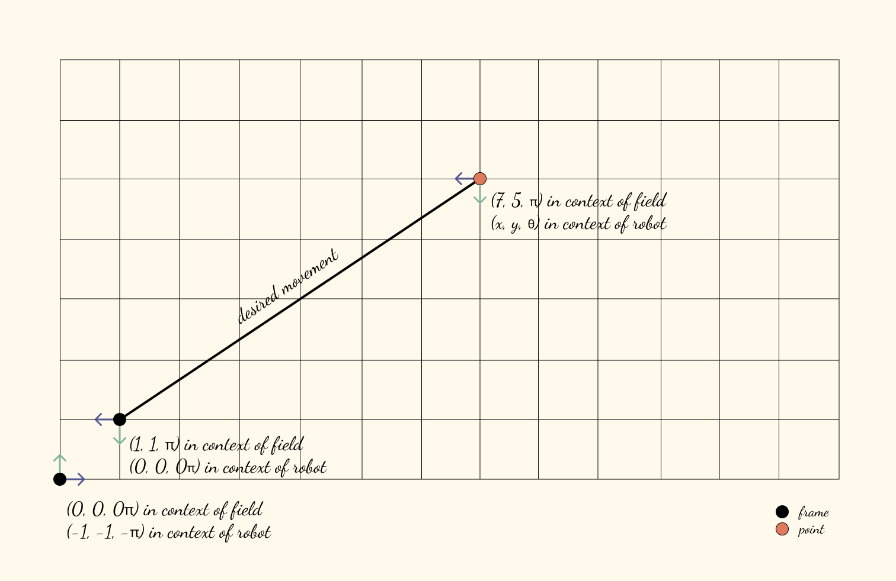

<h1 align="center"></h1>

You want to move your robot from point A to point B. That's all you ever want to do, really. The question is, how do you model the multiple frames that exist in your environment?

Say you have the following:



In short — `frames` solves for `(x, y)` like so:

```rust
use frames::prelude::*;

let mut (field, robot): (Frame, Frame) = (Frame::new(), Frame::new());
robot.is((1, 1, 45)).in_context_of(&field);

let (x, y) = field.point((7, 5, 0)).get_in_context_of(&robot);

assert_eq!((x, y), (6, 4));
```

## Features

 * **Efficient** — optimized, no-nonsense calculations.
 * **Scalable** — calculate in any dimensions.
 * **Type-safe** — errors can be seen at compile-time.

